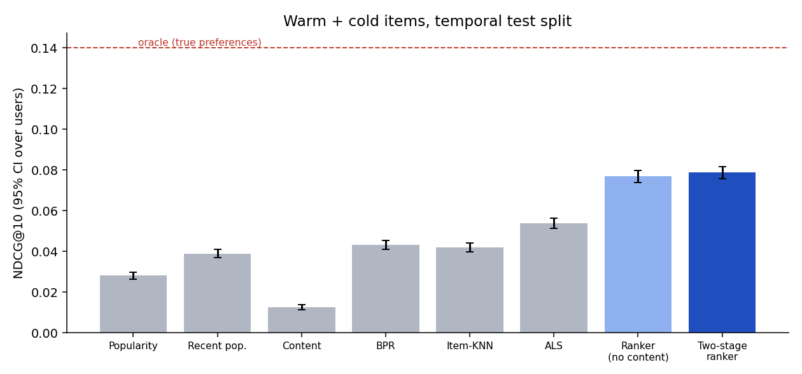

# recengine — two-stage recommender with a leakage-safe evaluation

[](https://github.com/shanchacko7829/recsys-engine/actions)

Recommendation models written from scratch in numpy/scipy (popularity, item-KNN, ALS, BPR, content-based), combined by a two-stage pipeline: several candidate generators, then a gradient-boosted ranker. The focus is **evaluation done properly**: temporal splits, hyper-parameters tuned on a separate validation window, one final test run, confidence intervals, cold-start and diversity metrics, and an oracle ceiling.



## Important: the data is simulated
Public datasets (MovieLens etc.) could not be downloaded where this was built, so `simulate.py` generates interaction logs from hidden user/item taste vectors, item popularity bias, item release times and taste-independent noise (6,000 users, 2,500 items, 269,761 events). The benefit: the true preferences are known, so we can compute an **oracle** (the best any model could score) and test brand-new items honestly. The cost: **these numbers say how the methods compare on this simulator, not how they would score on a real product.** The code is generic (it only needs a user/item/time event table), but I have not run it on a real dataset.

## Results (test window t in [0.9, 1.0], 5,898 users, produced by `python -m recengine eval`)

Split by time: train t<0.8, validation 0.8–0.9 (hyper-parameters and the ranker are fitted here), test 0.9–1.0 (touched once). Items a user already used are never recommended.

| Method | NDCG@10 (95% CI) | Recall@20 | Recall@20 on new items |
|---|---|---|---|
| Popularity | 0.028 [0.026, 0.030] | 0.052 | 0 |
| Recent popularity | 0.039 [0.037, 0.041] | 0.062 | 0 |
| Content-based | 0.012 [0.011, 0.014] | 0.023 | 0.032 |
| BPR | 0.043 [0.041, 0.045] | 0.069 | 0 |
| Item-KNN | 0.042 [0.040, 0.044] | 0.069 | 0 |
| ALS | 0.054 [0.051, 0.056] | 0.085 | 0 |
| **Two-stage ranker** | **0.078** [0.075, 0.081] | 0.113 | 0 |
| Ranker + 20% slots for new items | 0.071 [0.068, 0.074] | 0.101 | 0.041 |
| *Oracle (knows true preferences)* | *0.140* | *0.181* | *0.208* |

Paired differences in NDCG@10 (bootstrap over users, all intervals exclude 0):
* Ranker − ALS: **+0.0245** [0.0221, 0.0271]. ALS − Item-KNN: +0.012. ALS − BPR: +0.011.
* Reserving slots for brand-new items costs **−0.0073** NDCG@10 [−0.0080, −0.0066] and gains new-item recall (0 → 0.041). That trade-off is a product decision; I report both.
* Content features add only **+0.0013** [0.0001, 0.0026] to the ranker. Most of the ranker's gain comes from combining interaction-based signals; I did not isolate which features matter most.

Honest limitations:
* The best model reaches about 56% of the oracle's NDCG@10, and new-item recall (0.04) is far below the oracle's (0.21). Cold-start is not solved.
* Only ALS and Item-KNN were tuned (small grid on validation). BPR used fixed settings, so the BPR vs ALS gap is partly a tuning gap.
* Candidate generation caps the ranker: the union of generators (≈225 items per user) contains 36% of a user's test items.
* 7.4% of test events are on items with no history; popularity-style models score 0 on them by construction.
* Exposure bias (users only interact with what they are shown) is not modelled; every user can interact with every item.

## How it works
1. **Candidates** (`pipeline.py`): top items from ALS (100), BPR (50), item-KNN (50), content-based (50), recent popularity (30), and content-ranked brand-new items (30).
2. **Ranker**: `HistGradientBoostingClassifier` on 14 features per (user, item): each generator's score and rank, item popularity and age, user activity. Trained on validation labels with generators fitted on train only; at test time the generators are refitted on train+validation.
3. **Models** (`models.py`): ALS for implicit feedback (Hu–Koren–Volinsky, per-row ridge solves), BPR (mini-batch SGD with Adagrad and negative sampling that rejects true positives), shrunk cosine Item-KNN, content-based profile cosine.
4. **Serving** (`service.py`): `POST /v1/recommend` (known user, or a new user by `history` via ALS fold-in), `GET /v1/similar/{item}`, `/health`. Median latency of the full two-stage path is 4.7 ms, p95 7.4 ms (single process, CPU).
5. **Metrics** (`metrics.py`): Recall/NDCG/Hit@k, catalogue coverage, novelty, Gini of exposure, bootstrap CIs.

## Run it
```bash
pip install -r requirements-dev.txt
pip install -e .
python -m unittest discover -s tests -t . -v        # 27 tests
python -m recengine eval                             # ~4 min: simulate, tune, train, test; writes results/eval.json
python -m recengine plots
python -m recengine recommend --user 5               # uses the bundle saved by eval
python -m recengine serve                            # then POST /v1/recommend {"user_id": 5, "k": 10}
```
The ranker is saved with `pickle` (scikit-learn model): only load model folders you created yourself.
